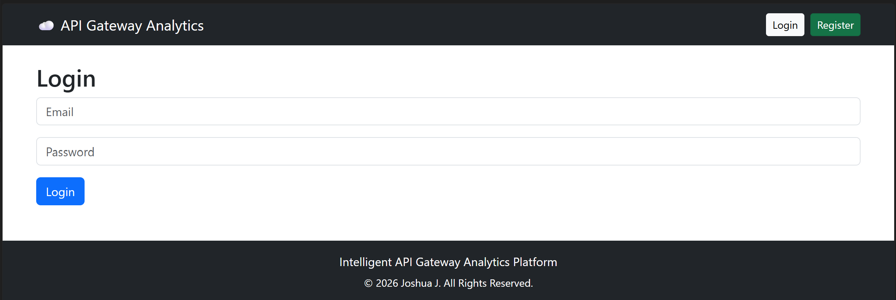
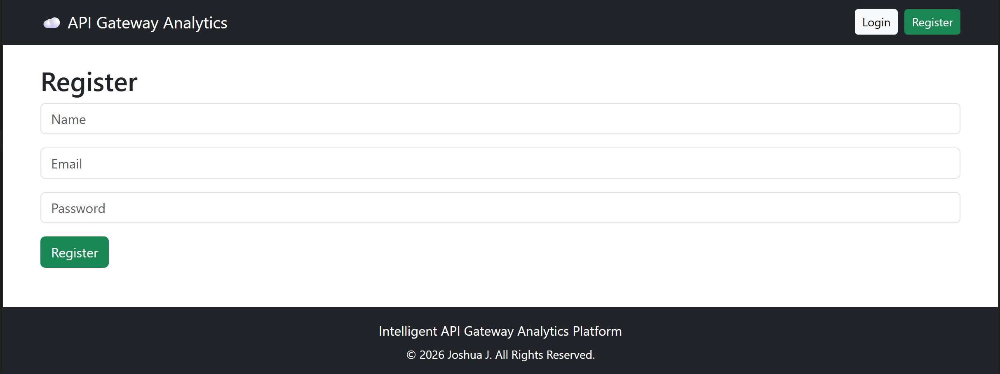
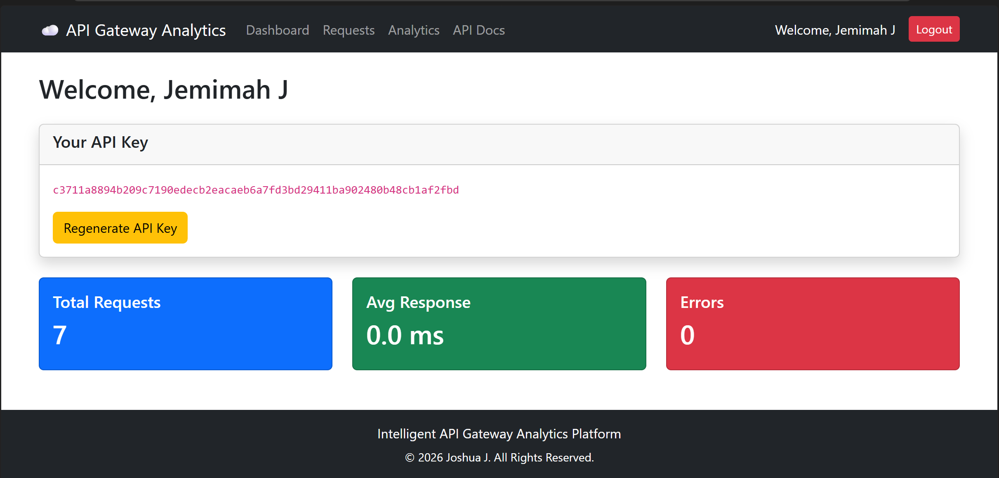
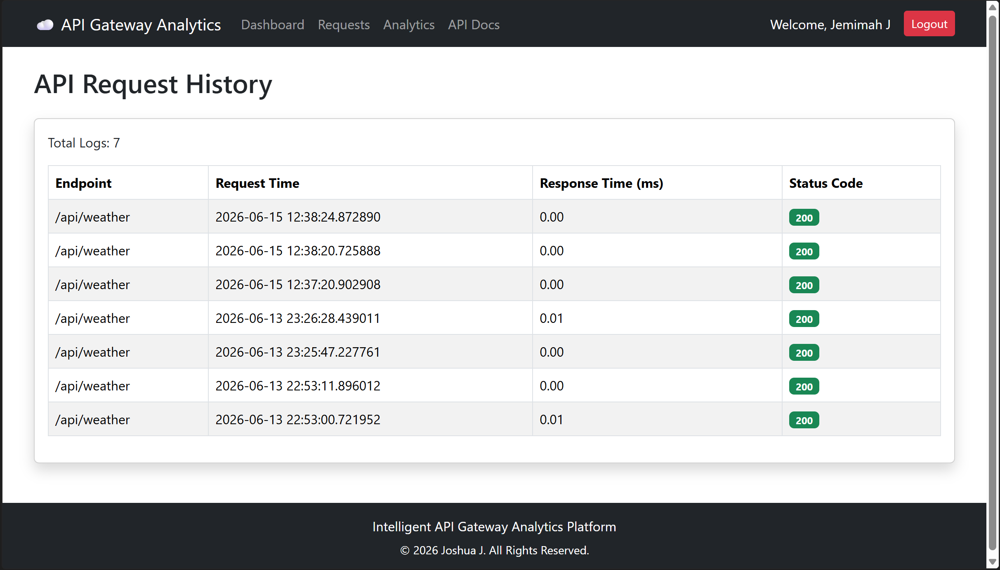
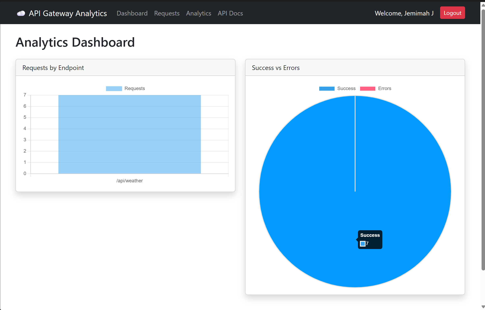
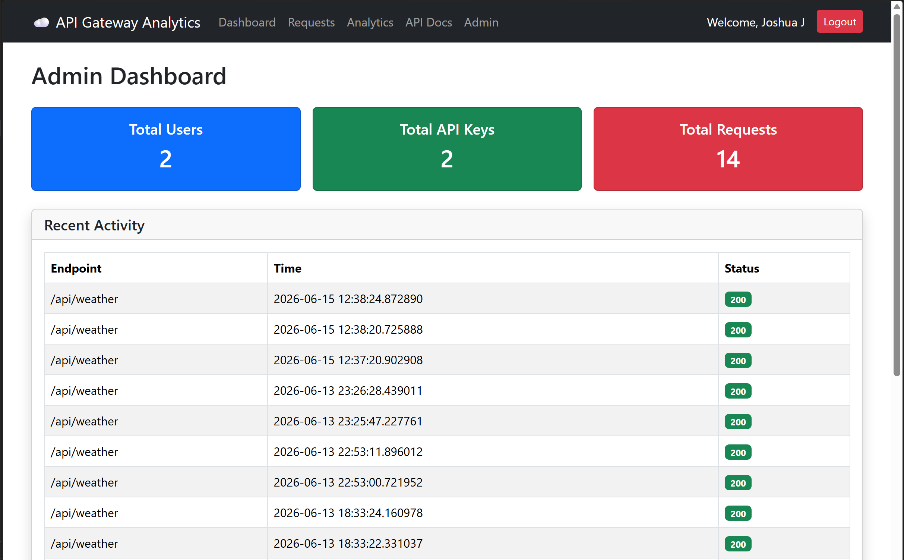
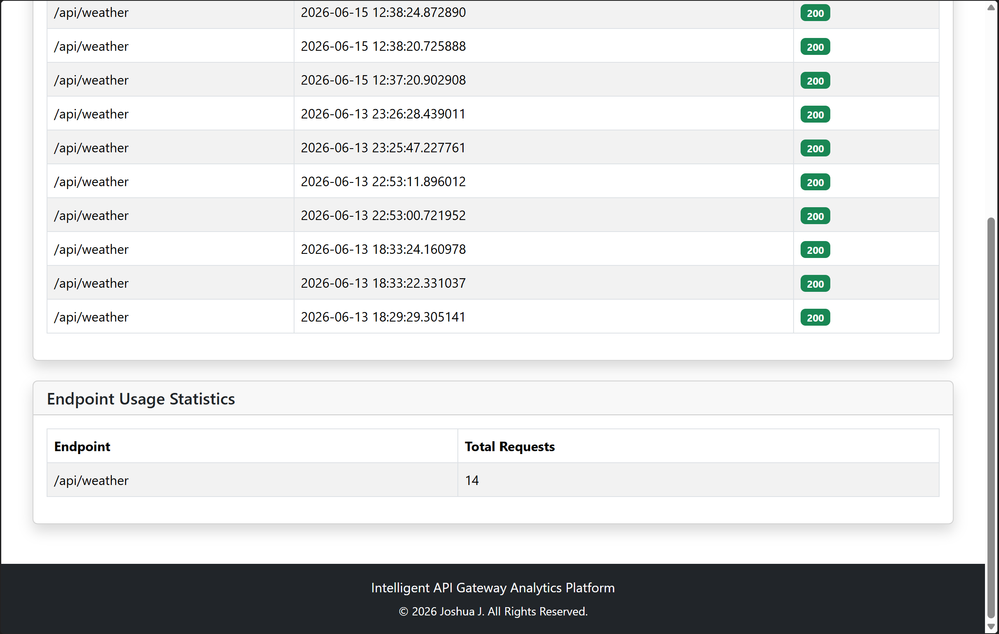
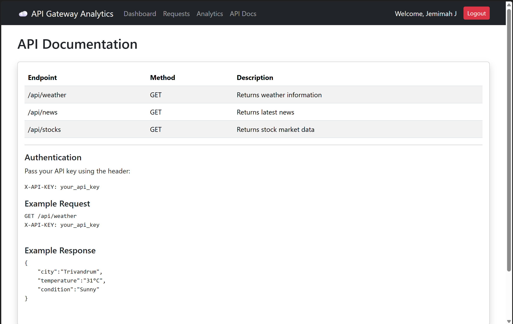

# API Gateway Analytics Platform

A full-stack Flask application for managing API access, monitoring usage, and analyzing request activity.

---

## Features

### Authentication System

* User Registration
* User Login
* Session Management
* Role-Based Access Control (Admin/User)

### API Key Management

* Generate API Keys
* Regenerate API Keys
* Secure API Authentication

### API Gateway

* Live Weather API Integration (OpenWeatherMap)
* Real-time weather data fetched from OpenWeatherMap API
* Supports dynamic city lookup
* API Gateway authentication and request logging
* News Endpoint
* Stocks Endpoint
* API Key Validation

### Request Monitoring

* Request Logging
* Status Code Tracking
* Timestamp Recording
* User Activity History

### Security Features

- API Key Authentication
- API Key Regeneration
- Rate Limiting (5 Requests/Minute)
- Request Monitoring

### Analytics Dashboard

* Requests by Endpoint
* Success vs Error Tracking
* Interactive Charts using Chart.js

### Admin Dashboard

* Total Users
* Total API Keys
* Total Requests
* Recent Activity Monitoring
* Endpoint Usage Statistics

### Database

* PostgreSQL
* Users Table
* API Keys Table
* API Logs Table

### Deployment

* Docker Support
* Docker Compose Configuration

---

## Tech Stack

### Backend

* Flask
* Python
* PostgreSQL
* Psycopg2

### Frontend

* HTML
* Bootstrap 5
* Jinja2
* Chart.js

### DevOps

* Docker
* Docker Compose

---

## Database Schema

### Users

| Field    | Type    |
| -------- | ------- |
| id       | SERIAL  |
| name     | VARCHAR |
| email    | VARCHAR |
| password | TEXT    |
| role     | VARCHAR |

### API Keys

| Field   | Type    |
| ------- | ------- |
| id      | SERIAL  |
| user_id | INTEGER |
| api_key | TEXT    |

### API Logs

| Field         | Type      |
| ------------- | --------- |
| id            | SERIAL    |
| user_id       | INTEGER   |
| endpoint      | TEXT      |
| response_time | FLOAT     |
| status_code   | INTEGER   |
| request_time  | TIMESTAMP |

---

## Screenshots

### Login Page



### Registration Page



### User Dashboard



### Request History



### Analytics Dashboard



### Admin Dashboard Overview



### Admin Statistics



### API Documentation




---

## Running Locally

```bash
git clone https://github.com/JoshuaJ290304/api-gateway-analytics.git

cd api_gateway

pip install -r requirements.txt

python app.py
```

---

## Docker

```bash
docker compose up -d
```

---

## Future Enhancements

* JWT Authentication
* OpenAPI / Swagger Documentation
* Email Verification
* API Usage Quotas
* Redis Caching
* Kubernetes Deployment

---

## Author

Joshua J
